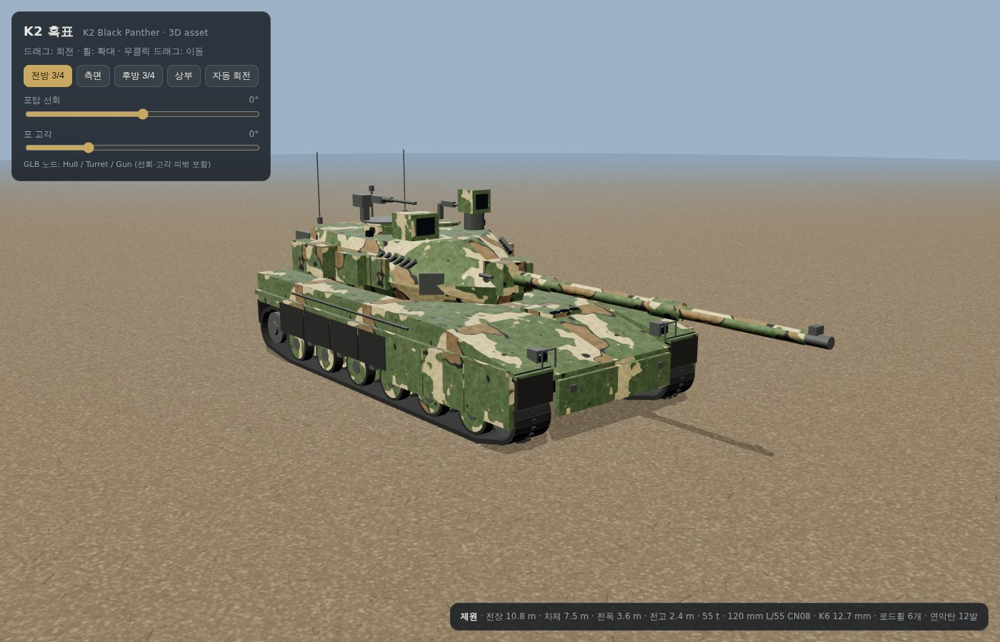

# K2 흑표 (K2 Black Panther) 3D 에셋

대한민국 육군 주력전차 **K2 흑표**를 공개 제원을 바탕으로 절차적으로(procedurally) 생성한 3D 에셋입니다.
파이썬 스크립트 하나로 형상·PBR 재질·위장 텍스처를 모두 만들고 GLB/OBJ로 내보냅니다.



| 파일 | 설명 |
| --- | --- |
| `assets/k2_black_panther.glb` | 메인 에셋 (glTF 2.0 바이너리, PBR 재질·텍스처 내장, 약 19,000 삼각형) |
| `assets/k2_black_panther_1024.glb` | 웹용 경량판 (1024² 텍스처, 약 6.6 MB) |
| `assets/obj/` | OBJ + MTL + 텍스처 (Blender, 3ds Max, Unity 등 범용 임포트용) |
| `assets/k2_camo_albedo.png` | 2048² 위장 알베도 텍스처 (한국군 4색: 녹색·갈색·모래색·검정 + 오염) |
| `assets/k2_camo_metalrough.png` | 2048² 금속성/거칠기 텍스처 |
| `viewer.html` | three.js 웹 뷰어 (궤도 카메라, 포탑 선회·포 고각 슬라이더) |
| `build_k2.py` | 에셋 생성 스크립트 |
| `previews/` | 렌더 미리보기 |

## 재현된 K2 외형 특징

- 전장 10.8 m(포 전방) · 차체 7.5 m · 전폭 3.6 m · 전고 2.4 m 비율
- 120 mm L/55 CN08 활강포: 서멀 슬리브, 배연기, 포구 기준장치
- 쐐기형(화살촉) 전면 포탑, 자동장전장치용 긴 버슬, 후방 수납 바스켓
- 우전방 포수 조준경(KGPS), 좌전방 전차장 파노라마 조준경(KCPS)
- 우후방 전차장 큐폴라 + K6 12.7 mm 중기관총, 좌후방 포수 해치 + 7.62 mm
- 좌우 6발씩 연막탄 발사기 12발, 포탑 전면 모서리 밀리미터파 레이더, 레이저 경보기
- 측면 로드휠 6개, 후방 구동륜, 전방 유동륜, 리턴롤러, 암내장식 현수장치(ISU) 스텁
- 전방 복합장갑 스커트 + 후방 고무 스커트, 견인 케이블, 엔진 데크 그릴, 후면 배기 루버
- 조종수 해치·잠망경, 헤드라이트 가드, 예비 궤도, 안테나, 풍속 센서

## 노드 구조 (애니메이션용)

GLB는 세 개의 노드로 나뉘어 있고 피벗이 실제 회전축에 맞춰져 있습니다.

```
Hull            ← 차체 + 주행장치
└─ Turret       ← 포탑 링 중심이 원점 (Y축 회전 = 선회)
   └─ Gun       ← 포이축(trunnion)이 원점 (Z축 회전 = 고각)
```

좌표계: +X 전방, +Y 상방, +Z 우측, 단위 m.

## 실행

```bash
pip install numpy trimesh shapely pillow mapbox-earcut scipy
python3 build_k2.py            # assets/ 재생성 (2048² 텍스처, OBJ 포함)
K2_TEX=1024 python3 build_k2.py  # 웹용 경량 GLB
```

`viewer.html`은 로컬 파일로 열면 브라우저 보안 정책 때문에 GLB 로드가 막힙니다.
폴더에서 `python3 -m http.server` 를 실행한 뒤 `http://localhost:8000/viewer.html` 로 접속하세요.

## 한계

사진 스캔이나 수작업 스컬프팅 없이 기본 도형만으로 만든 모델이라 실제 사진 수준의 디테일(용접선, 볼트, 캐스팅 표면, 정확한 장갑 모듈 형상)은 없습니다.
게임 프로토타입, 시각화, 하이폴리 모델링의 블록아웃 기준 형상으로 쓰기에 적합합니다.
